# OOTB - Basic Profile Management

 

## Input Schemas
| Property Name | Description | Expanded | Preferred Control Type | Preferred Data Type | Required |
|----------------------------------|-----------------|-----------------|-----------------|-----------------|-----------------|
| flowParameters |  | true | textField | object | false | 
 

## Variables
| Variable | Value | Context | Display Name | Field Type | Min | Max | Mutable | Type |                                                                                                                                                                
|----------------------------------|-----------------|-----------------|-----------------|-----------------|-----------------|-----------------|-----------------|-----------------|
| username##SK##flowInstance |  | flowInstance |  | string | 0 | 2000 | true | property | 
 

## Node List
| Node ID | Title | Description |
|----------------------------------|-----------------|-----------------|
| [0rgxvbc224](./nodes/0rgxvbc224.md) | Set Flow Parameters |  | 
 | [15v6mldd6g](./nodes/15v6mldd6g.md) | Http |  | 
 | [1u0vwi4oze](./nodes/1u0vwi4oze.md) | Annotation | Update the User in PingOne | 
 | [4j666388n9](./nodes/4j666388n9.md) | Update error message |  | 
 | [4z197u73t8](./nodes/4z197u73t8.md) | Annotation | Find user in PingOne based on the input coming into the workflow | 
 | [98l736kzfn](./nodes/98l736kzfn.md) | Profile Update |  | 
 | [9zuo4wddgf](./nodes/9zuo4wddgf.md) | Success |  | 
 | [b028sqws7r](./nodes/b028sqws7r.md) | PingOne |  | 
 | [dq7qpghe4g](./nodes/dq7qpghe4g.md) | Annotation | Parse zip code and address separately | 
 | [guj1pyh616](./nodes/guj1pyh616.md) | Annotation | Display end result | 
 | [jh7fbt0cqw](./nodes/jh7fbt0cqw.md) | Annotation | Display error | 
 | [jjweor94k9](./nodes/jjweor94k9.md) | Extract Flow Parameters |  | 
 | [phud6qg15h](./nodes/phud6qg15h.md) | PingOne |  | 
 | [psu8mrv4k9](./nodes/psu8mrv4k9.md) | Functions |  | 
 | [vtw40m5str](./nodes/vtw40m5str.md) | Annotation | Form that asks for user information | 
 | [zpk0eome97](./nodes/zpk0eome97.md) | Error Message |  | 
 